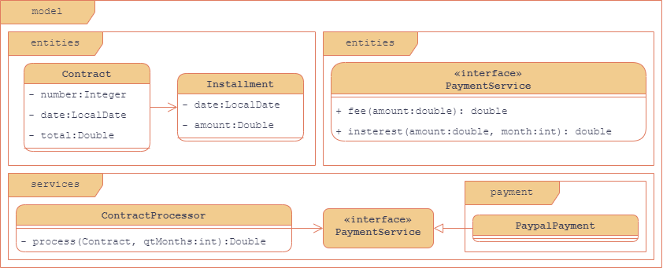

# Parcelas contratos



Uma empresa deseja automatizar o processamento dos contratos. O processamento consiste em gerar as parcelas a serem pagas para aquele contrato, com base no número de meses desejados.

A empresa utiliza um *serviço de pagamento* online para realizar o pagamento das parcelas. Os serviços de pagamento. Por enquanto, o serviço contratado pela empresa é o do Paypal, que aplica juros simples de 1% a cada parcela, mais uma taxa de pagamento de 2%.

Fazer um programa para ler os dados de um contrato (número, data e valor total do contrato). Em seguida, o programa deve ler o número de meses para parcelamento do contrato, daí gerar os registros de parcelas a serem pagas (data e valor), sendo a primeira parcela a ser paga um mês após o contrato, a segunda dois meses e assim por diante. Mostrar os dados das parcelas na tela.

## Exemplos

```shell
Enter contract data
Number: 8028
Date (dd/MM/yyyy): 25/06/2018
Contract value: 600.00
Enter the number of installments: 3
Installments:
25/07/2018 - 206.04
25/08/2018 - 208.08
25/09/2018 - 210.12
```
